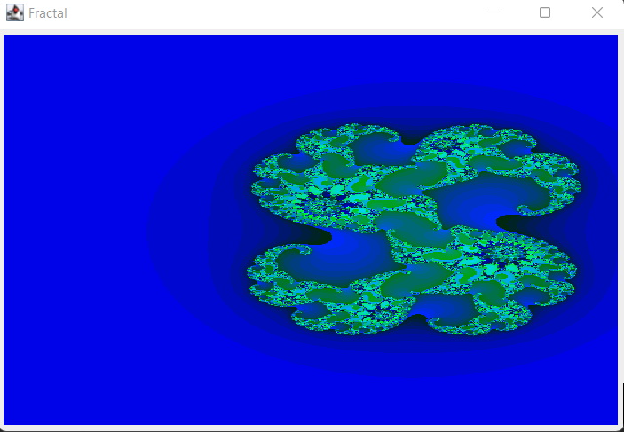
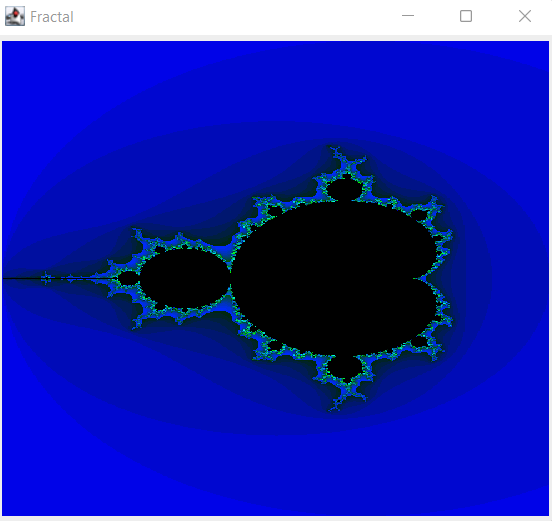

# Fractal_Java

[JULIA](https://en.wikipedia.org/wiki/Julia_set) and [MANDELBROT](https://en.wikipedia.org/wiki/Mandelbrot_set)  set of Fractal with canva

You can launch a [DEMO](Fractals/) of this program

1. Import the folder [Folder](Fractals/) to your IDE 

2. Open the class [Main class](Fractals/src/FractalPanel.java) and choose your favorite set Julia or Mandelbrot line 23 

3. run Fractal Frame [Main class](Fractals/src/FractalFrame.java)

4. Enjoy the View !

 
 

